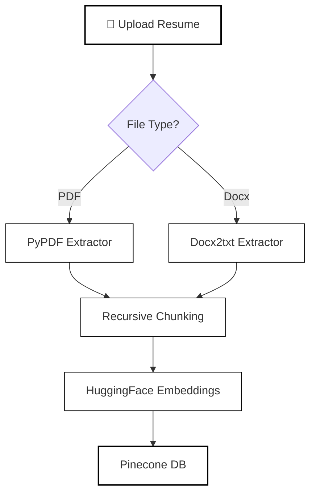
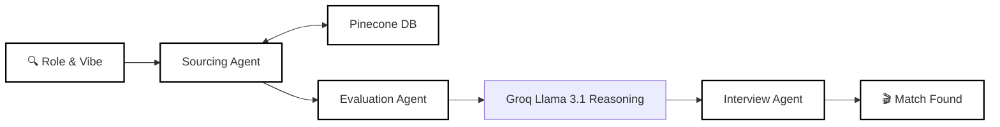

# Media Talent Headhunter: Multi-Agent RAG System

A sophisticated AI-powered recruitment platform designed for the Media and Entertainment industry. This system uses **Semantic Search** and an **Agentic Workflow** to source, evaluate, and prepare candidates for high-stakes production roles.

## Key Features

- **Resume Upload & Ingestion**: Support for PDF and DOCX files with real-time text extraction and vector embedding.
- **Semantic Search**: Powered by **Pinecone** and **HuggingFace Embeddings** (`all-MiniLM-L6-v2`) for "meaning-based" talent discovery.
- **Multi-Agent Workflow**:
  - **Sourcing Agent**: Retrieves the most relevant talent chunks.
  - **Evaluation Agent**: Performs a "Red Carpet" assessment of "Production Style" and "Cultural Fit."
  - **Interview Agent**: Generates 3 highly specific technical/style questions for the candidate.
- **Local & Fast**: Uses local embeddings to save costs and **Groq (Llama 3.1)** for lightning-fast reasoning.

## System Architecture

### 1. Data Ingestion Flow



### 2. AI Agentic Matching Workflow



[Full Architecture Details Here](file:///C:/Users/admin/.gemini/antigravity/brain/9c94b4b9-a4ef-4a5b-8842-2e7acde17304/architecture.md)

## Tech Stack

- **Framework**: LangChain
- **Frontend**: Streamlit
- **Vector DB**: Pinecone
- **LLM**: Groq (Llama-3.1-8b-instant)
- **Embeddings**: HuggingFace (Local)

## Prerequisites

- Python 3.10+
- Pinecone API Key (Free Tier works)
- Groq API Key

## Installation

1. **Clone the repository**:

   ```bash
   git clone https://github.com/Abdullasaqib/Agentic-ATS-System.git
   cd RAG
   ```
2. **Set up Virtual Environment**:

   ```bash
   python -m venv venv
   .\venv\Scripts\activate
   ```
3. **Install Dependencies**:

   ```bash
   pip install -r requirements.txt
   ```
4. **Configure Environment Variables**:
   Create a `.env` file in the root directory (refer to `.env.example`):

   ```env
   PINECONE_API_KEY=your_key
   PINECONE_ENV=your_env
   GROQ_API_KEY=your_key
   ```

## Running the Application

To start the Streamlit dashboard:

```bash
streamlit run src/main.py
```

## Project Structure

- `src/agents/`: Specialized AI agent definitions.
- `src/ingestion.py`: Logic for document parsing and Pinecone upserting.
- `src/vector_db.py`: Pinecone client and index management.
- `src/main.py`: Streamlit UI and agent orchestration.
